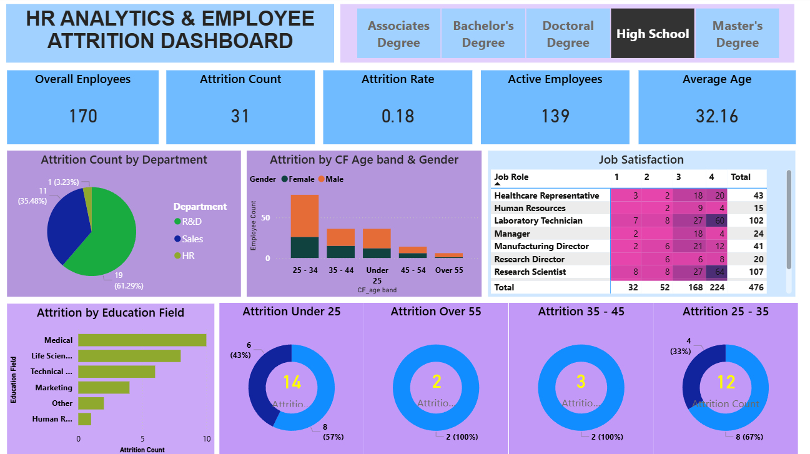

## HR-Employee-Attrition-Analysis

Employee attrition analytics is specifically focused on identifying why employees voluntarily leave, what might have prevented them from leaving, and how we can use data to predict attrition risk.

## Dashboard

## Project Overview

This project analyzes employee HR data to identify attrition patterns across departments, age groups, gender, education fields, job roles, and employee satisfaction levels.

## Tools & Technologies

- Power BI
- Excel
- Power Query
- DAX

## Key KPIs

- Overall Employees: 170
- Attrition Count: 31
- Attrition Rate: 18%
- Active Employees: 139
- Average Age: 32.16
